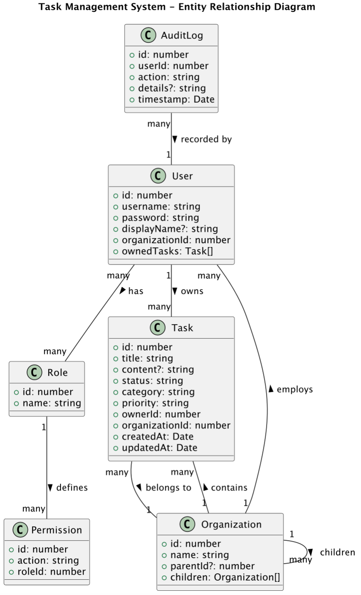
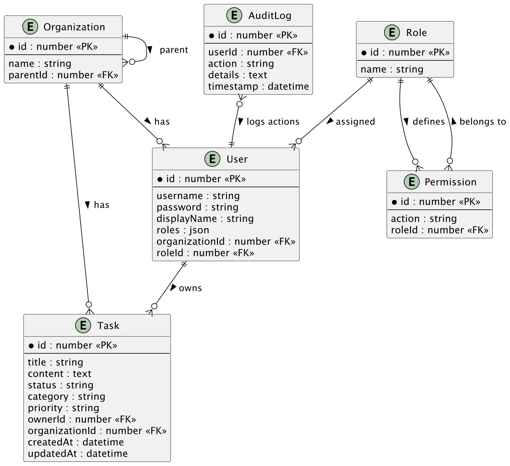
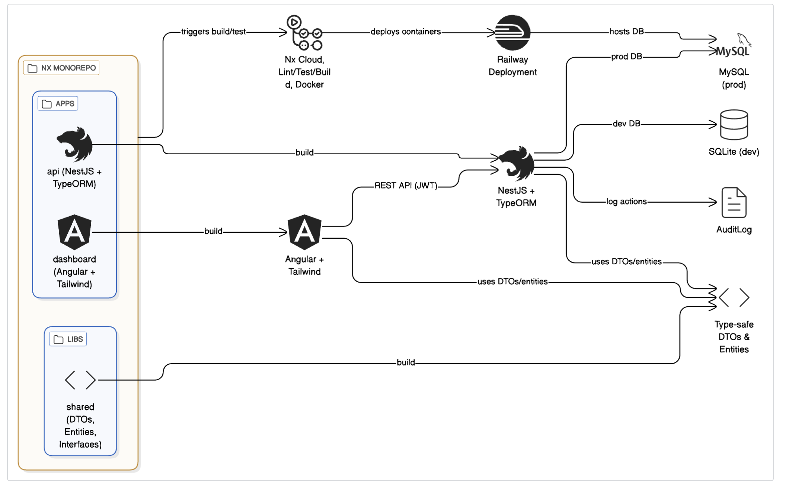

# Task Management System

Hi! 👋 My name is **Nomin**, and I built this **Task Management System** following a **modular NX monorepo** approach using **Angular + NestJS + TailwindCSS + TypeScript**.

This system is secure and role-based, allowing users to manage tasks according to their **roles** and **organization hierarchy**. Below, I’ll walk you through how I structured, implemented, and secured this project.

---

## Setup Instructions

### 1. Clone Repository

```bash
git clone https://github.com/Nomin7711/task-mgnt-workspace.git
cd task-management-system
```

### 2. Install Dependencies

```bash
npm install
```

### 3. Configure .env

```bash
JWT_SECRET=Qwerty123!
JWT_EXPIRES_IN=3600
BCRYPT_SALT_ROUNDS=10
DB_TYPE=sqlite
```

### 4. Run Backend & Frontend

## Backend (NestJS API):

```bash
nx serve api
```

## Frontend (Angular Dashboard):

```bash
nx serve dashboard
```

### Architecture Overview

### NX Monorepo Layout

```bash
apps/
├─ api/ → NestJS backend
├─ dashboard/ → Angular frontend

libs/
├─ data/ → Shared TypeScript interfaces & DTOs
├─ auth/ → Reusable RBAC logic, decorators, and guards
```

### 🧱 Rationale

I implemented this project using the **NX monorepo structure** because it allows me to organize the backend and frontend within a single, unified workspace.  
This structure makes it easy to share code and manage dependencies consistently across both applications.

By separating each part into its own app (API and Dashboard) while still keeping them in the same repository, I can:

- Develop backend and frontend in parallel without switching projects.
- Reuse common logic like DTOs and interfaces.
- Maintain consistency in types, data validation, and structure.
- Speed up builds, testing, and linting since NX caches and coordinates all tasks efficiently.

Overall, NX helps keep the codebase modular, scalable, and easy to extend if I want to add more services or apps later.

### 📦 Shared Libraries

I also implemented shared libraries to reduce duplication and improve maintainability:

- **`data/`** → Contains shared **TypeScript interfaces, DTOs, and enums** used by both backend and frontend.  
  This ensures that both sides use the same data structure, preventing mismatched fields and improving type safety.

- **`auth/`** → Contains reusable **RBAC (Role-Based Access Control) logic**, including **custom decorators** and **guards** that check permissions.  
  This makes access control logic centralized, meaning if I update a rule or add a new permission, it automatically applies everywhere in the system.  
  It also improves code clarity — instead of repeating permission checks in every controller, I simply use decorators like `@Permissions('task:create')`.

Using shared libraries gives the project a clear separation of concerns, encourages reusability, and keeps the logic consistent between frontend and backend.

### 🧩 Use Case Diagram Description – Task Management System

## Entities: User, Organization, Role, Permission, Task, AuditLog

1. The system should register Users and assign them to specific Organizations.
2. The system should allow Users to log in using JWT authentication.
3. The system should validate User roles (Owner, Admin, Viewer) upon login.
4. The system should allow authorized Users to create, edit, delete Tasks.
5. The system should display all Tasks visible to the User, based on their role and organization.
6. The system should restrict access so that Viewers can only view, not edit or delete tasks.
7. The system should enforce organization-level access, allowing Users to only interact with data within their organization or its children.
8. The system should log all important User actions (e.g., task creation, deletion, login) into the AuditLog.
9. The system should allow Owners and Admins to view the Audit Log for compliance and security tracking.
10. The system should support multi-level Organizations (parent → child hierarchy).
11. The system should inherit role permissions, so Admins automatically get Viewer access capabilities.
12. The system should allow Admins to create or manage users within their organization scope.
13. The system should prevent unauthorized Users from accessing or modifying data from other organizations.
14. The system should display Task analytics (e.g., bar charts) for Owners/Admins.

### Data Model Explanation

#### Core Entities

- **User** → Belongs to an organization and has one role. Each user can own multiple tasks.
- **Organization** → Supports a two-level hierarchy (parent → child) and links to both users and tasks.
- **Role** → Defines access level (Owner, Admin, Viewer) and links to permissions.
- **Permission** → Specifies allowed actions per role (CRUD, manage users/orgs, view logs).
- **Task** → Associated with a user and organization; tracks title, description, status, and metadata.
- **AuditLog** → Records user actions for transparency and compliance.

#### Design Rationale

This schema cleanly separates responsibilities:

- **Type safety & reusability:** Using shared libraries for entities ensures consistency across backend and frontend.
- **RBAC flexibility:** Permissions are linked to roles instead of users, simplifying updates when access policies change.
- **Organizational hierarchy:** Supports real-world multi-tenant use cases with parent–child relationships.
- **Auditing:** Every critical action is logged to improve security traceability.

## Class diagram



## ERD/diagram



## Solution architect diagram



### Access Control Implementation

Roles & Permissions

- Roles: Owner (full), Admin (limited), Viewer (read-only)

- Permissions: Each action like task:create, task:read is mapped to roles

- Organization Scope: Users can only access tasks within their org hierarchy

### Decorators & Guards

- Custom decorators mark endpoints with required permissions

- Guards check JWT and permissions before executing endpoint

Example: @Permissions('task:create') ensures only allowed users can create tasks

### JWT Integration

- JWT stores user ID and role

- Middleware validates token on every request

- Guards extract role/permissions from JWT to enforce access control

### Permissions Table

| ID  | Permission  | Level |
| --- | ----------- | ----- |
| 1   | task:create | 1     |
| 2   | task:read   | 1     |
| 3   | task:update | 1     |
| 4   | task:delete | 1     |
| 5   | user:manage | 1     |
| 6   | org:manage  | 1     |
| 7   | log:read    | 1     |
| 8   | audit:read  | 1     |
| 9   | task:create | 2     |
| 10  | task:read   | 2     |
| 11  | task:update | 2     |
| 12  | user:manage | 2     |
| 13  | log:read    | 2     |
| 14  | task:read   | 3     |

### Roles & Levels:

Owner: Full access (Level 1)

Admin: Limited access (Level 2)

Viewer: Read-only access (Level 3)

### API Documentation

| Method | Endpoint       | Description                               |
| ------ | -------------- | ----------------------------------------- |
| POST   | /tasks         | Create task                               |
| GET    | /tasks         | List accessible tasks                     |
| PUT    | /tasks/:id     | Edit task                                 |
| DELETE | /tasks/:id     | Delete task                               |
| GET    | /audit-log     | View access logs (Owner/Admin only)       |
| POST   | /users         | Create user (Owner/Admin only)            |
| GET    | /users         | List users (scoped by role/org)           |
| PUT    | /users/:id     | Update user details                       |
| DELETE | /users/:id     | Delete user                               |
| POST   | /organizations | Create new organization or sub-department |
| GET    | /organizations | List organizations (hierarchical)         |

---

## Sample Request:

```bash
POST /tasks
Authorization: Bearer <JWT_TOKEN>
Content-Type: application/json

{
  "title": "Finish Report",
  "description": "Complete by EOD",
  "status": "pending",
  "category": "Work",
  "priority": "High"
}
```

## Sample Response:

```bash
{
    "id": 1,
    "title": "Contact project team",
    "content": "contact with other teams",
    "status": "To Do",
    "category": "Personal",
    "priority": "High",
    "ownerId": 1,
    "organizationId": 1,
    "createdAt": "2025-10-18T00:36:52.000Z",
    "updatedAt": "2025-10-18T00:36:52.000Z",
    "owner": {
    "id": 1,
    "username": "superadmin",
    "displayName": admin,
    "roles": [
        "Owner"
        ],
        "organizationId": 1,
        "roleId": 1
    },
    "organization": {
        "id": 1,
        "name": "Corporate Headquarters",
        "parentId": null
    }
}
```

### 🧰 Postman Collection

You can test all API endpoints using the provided Postman collection:

[📥 Download Postman Collection](./postman/task-mngt.postman_collection.json)

<!-- ### 🚀 Future Considerations

**Advanced Role Delegation:**
In the future, I’d like to extend the RBAC system to support more dynamic permission control. For example, allowing temporary or conditional roles for users — like giving a Viewer temporary Admin access for a specific task or time period. This would make the system more flexible in real-world team scenarios.

**Production-Ready Security:**
For a production setup, I plan to implement JWT refresh tokens to avoid frequent re-login issues, add CSRF protection for safer HTTP requests, and introduce caching for RBAC data to minimize database lookups on each request. These steps will enhance both security and performance.

**Scaling Permission Checks:**
As the system grows, permission validation could become heavy. To handle that, I plan to use in-memory caching or precomputed role-permission maps to quickly determine user rights without hitting the DB repeatedly. This would help the system scale smoothly as organizations and tasks increase. -->

🚀 Future Considerations

Collaborative Tasks:
In the future, the system could allow adding coworkers or team members to tasks, so multiple users can work on the same task and track progress together.

Task Scheduling:
Adding time selection or deadlines for tasks will help users plan and prioritize their work more effectively.

Enhanced Notifications:
Users could receive reminders or notifications for upcoming tasks or changes made by collaborators.

### Summary

I implemented this Task Management System in a modular NX monorepo with full role-based access control, JWT authentication, and task management features. My backend solution enforces security through decorators, guards, and scoped access, making it scalable and maintainable for real-world use.

### Video Link

<!-- https://drive.google.com/drive/folders/1pIrvaK3Iqq4wyQLFQznkA-mLbrFXpguR?usp=sharing -->
